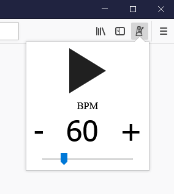

# Metronome web extension

Simple metronome in browser toolbar




## Installation

[Mozilla extension](https://addons.mozilla.org/en-US/firefox/addon/metronome-extension/)

## Developing

Run in two consoles:

```
npm run watch
```

```
npm run start
```

It will open Firefox with temporary installed extension with live reload.
